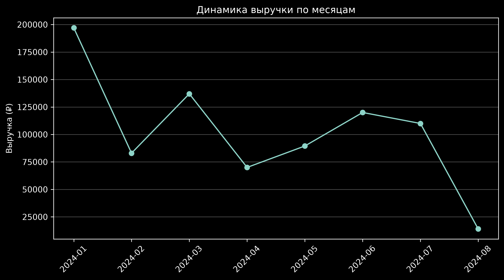
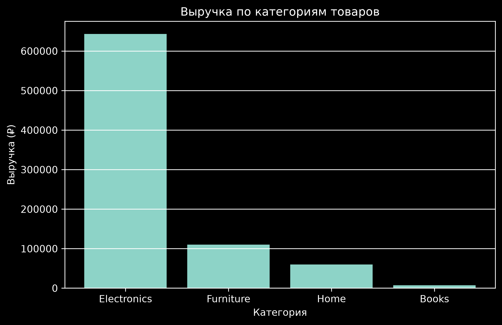
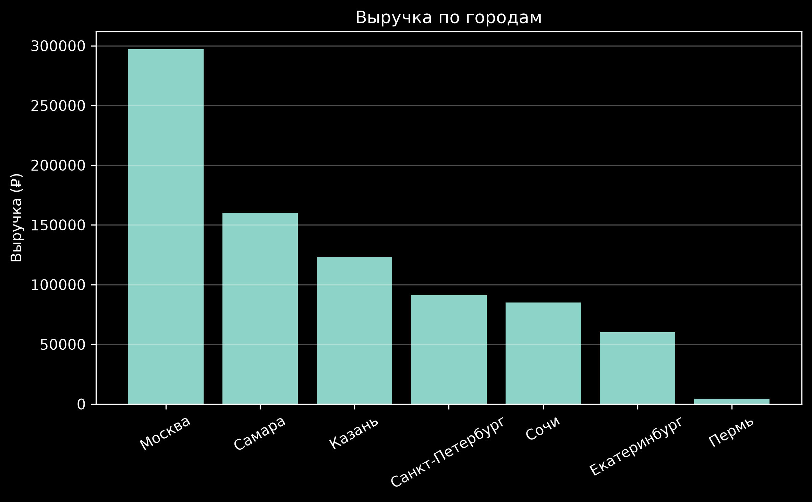
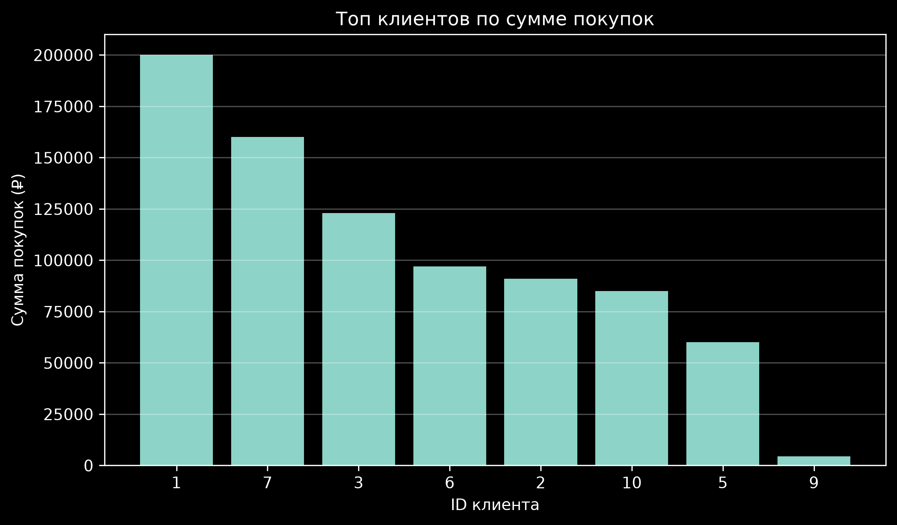
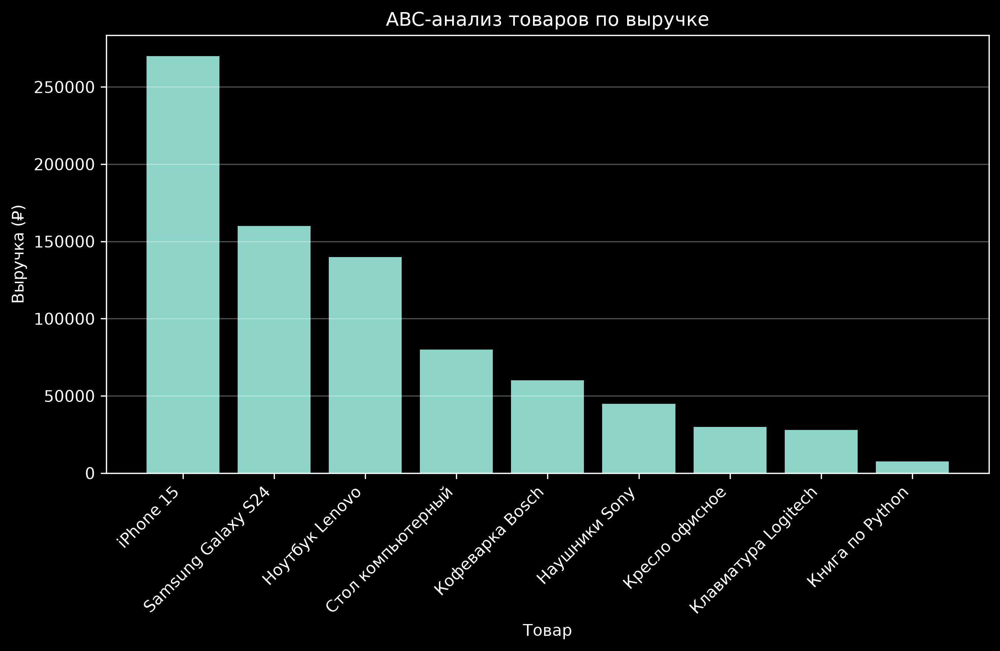
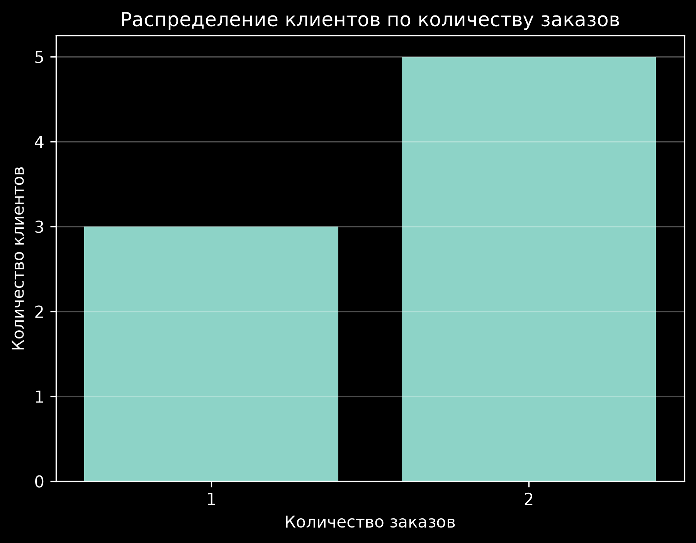
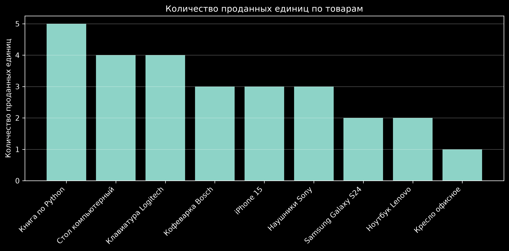
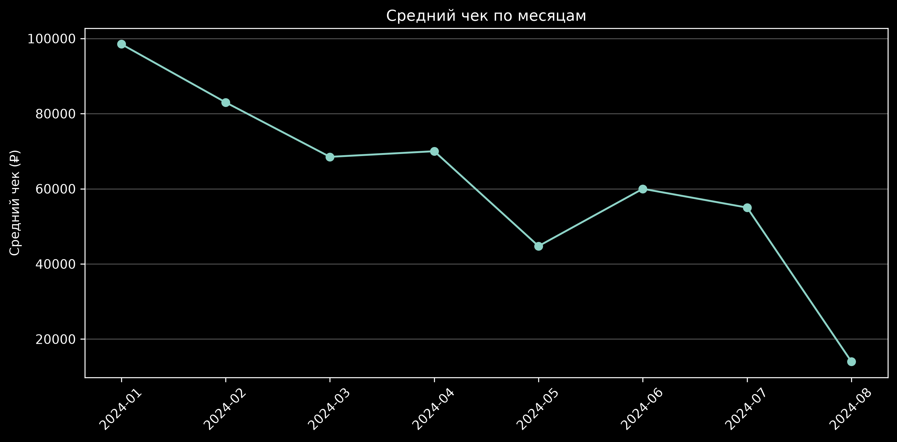

# E-commerce Sales Analysis

Анализ продаж интернет-магазина с использованием PostgreSQL, SQL и Python.

## О проекте

Цель проекта — проанализировать продажи интернет-магазина, определить наиболее прибыльные товары и категории, изучить поведение клиентов и динамику выручки.

В рамках проекта проведён анализ данных о клиентах, заказах, товарах и составе заказов.

### Используемые технологии

- PostgreSQL
- SQL
- Python
- Pandas
- Matplotlib
- Jupyter Notebook

## Структура данных

В проекте используются четыре основные таблицы:

- `customers` — информация о клиентах;
- `orders` — информация о заказах;
- `products` — информация о товарах;
- `order_items` — состав заказов и количество проданных товаров.

## SQL-анализ

### 1. Общая выручка

Общая выручка магазина по завершённым заказам составила:

**820 500 ₽**

### 2. Выручка по месяцам

Выручка по месяцам была рассчитана с помощью `DATE_TRUNC`.

| Месяц | Выручка |
|---|---:|
| Январь 2024 | 197 000 ₽ |
| Февраль 2024 | 83 000 ₽ |
| Март 2024 | 137 000 ₽ |
| Апрель 2024 | 70 000 ₽ |
| Май 2024 | 89 500 ₽ |
| Июнь 2024 | 120 000 ₽ |
| Июль 2024 | 110 000 ₽ |
| Август 2024 | 14 000 ₽ |

### Вывод

Наибольшая выручка была получена в январе 2024 года — **197 000 ₽**.

После снижения в феврале выручка выросла в марте, затем снова снизилась в апреле. В июне и июле наблюдался рост, однако в августе выручка значительно снизилась до **14 000 ₽**.

### 3. Топ-5 товаров по выручке

| Товар | Выручка |
|---|---:|
| iPhone 15 | 270 000 ₽ |
| Samsung Galaxy S24 | 160 000 ₽ |
| Ноутбук Lenovo | 140 000 ₽ |
| Стол компьютерный | 80 000 ₽ |
| Кофеварка Bosch | 60 000 ₽ |

### Вывод

Наибольший вклад в выручку внесли товары категории Electronics.

Лидером стал **iPhone 15** с выручкой **270 000 ₽**, что значительно превышает показатели остальных товаров.

### 4. Средний чек заказа

Средний чек завершённого заказа составил:

**63 115,38 ₽**

### 5. Количество заказов по месяцам

Количество завершённых заказов:

| Месяц | Количество заказов |
|---|---:|
| Январь 2024 | 2 |
| Февраль 2024 | 1 |
| Март 2024 | 2 |
| Апрель 2024 | 1 |
| Май 2024 | 2 |
| Июнь 2024 | 2 |
| Июль 2024 | 2 |
| Август 2024 | 1 |

### Вывод

Количество заказов в течение периода оставалось относительно стабильным.

Максимальное количество завершённых заказов было в январе, марте, мае, июне и июле — по **2 заказа**.

### 6. Топ-5 клиентов по сумме покупок

Клиенты с наибольшими расходами:

| Клиент | Город | Сумма покупок |
|---|---|---:|
| Клиент №1 | Москва | 200 000 ₽ |
| Клиент №7 | Самара | 160 000 ₽ |
| Клиент №3 | Казань | 123 000 ₽ |
| Клиент №6 | Москва | 97 000 ₽ |
| Клиент №2 | Санкт-Петербург | 91 000 ₽ |

### Вывод

Наибольший вклад в выручку внёс клиент №1 из Москвы с общей суммой покупок **200 000 ₽**.

Москва представлена среди самых ценных клиентов несколькими покупателями.

### 7. Доля отменённых заказов

Всего заказов:

**15**

Отменённых заказов:

**2**

Процент отмен:

**13,33%**

### Вывод

Большинство заказов успешно завершались.

Доля отменённых заказов составила **13,33%**, что может быть использовано для дальнейшего анализа причин отмен.

## Python-анализ

Для дополнительного анализа данные из PostgreSQL были загружены в Python с использованием Pandas.

В Python были выполнены:

- объединение таблиц заказов, товаров и состава заказов;
- расчёт выручки;
- анализ динамики выручки по месяцам;
- анализ выручки по категориям;
- анализ выручки по городам;
- анализ повторных покупок;
- ABC-анализ товаров;
- анализ количества проданных единиц;
- расчёт среднего количества товаров в заказе;
- анализ среднего чека по месяцам.

### 1. Основные результаты

- Общая выручка: **820 500 ₽**
- Средний чек: **63 115 ₽**
- Доля клиентов с повторными покупками: **62,5%**
- Среднее количество товаров в заказе: **2,08 шт.**
- Категория-лидер по выручке: **Electronics**
- Лидирующий товар по выручке: **iPhone 15**

### 2. ABC-анализ товаров

По результатам ABC-анализа:

- **A** — 4 товара, формирующие около 79% выручки;
- **B** — 2 товара, формирующие около 13% выручки;
- **C** — 3 товара, формирующие около 8% выручки.

Основную часть выручки формируют несколько ключевых товаров, поэтому именно они имеют наибольшее значение для бизнеса.

### 3. Повторные покупки

Всего клиентов:

**8**

Клиентов с повторными покупками:

**5**

Процент клиентов с повторными покупками:

**62,5%**

### Вывод

Более половины клиентов совершили повторные покупки.

Доля повторных клиентов в размере **62,5%** может свидетельствовать о достаточно высокой вовлечённости клиентов и наличии повторного спроса.

### 4. Среднее количество товаров в заказе

Среднее количество товаров в одном заказе составило:

**2,08 шт.**

Это означает, что в среднем один заказ содержал немного больше двух единиц товара.

### 5. Продажи по категориям

| Категория | Выручка |
|---|---:|
| Electronics | 643 000 ₽ |
| Furniture | 110 000 ₽ |
| Home | 60 000 ₽ |
| Books | 7 500 ₽ |

### Вывод

Категория **Electronics** является главным источником выручки — **643 000 ₽**.

Она значительно опережает остальные категории. На втором месте находится Furniture с выручкой **110 000 ₽**.

Категория Books имеет наименьший вклад в общую выручку — **7 500 ₽**.

### 6. Продажи по городам

| Город | Выручка |
|---|---:|
| Москва | 297 000 ₽ |
| Самара | 160 000 ₽ |
| Казань | 123 000 ₽ |
| Санкт-Петербург | 91 000 ₽ |
| Сочи | 85 000 ₽ |
| Екатеринбург | 60 000 ₽ |
| Пермь | 4 500 ₽ |

### Вывод

Москва занимает первое место по выручке — **297 000 ₽**.

Также значительный вклад внесли клиенты из Самары и Казани.

Пермь имеет минимальную выручку среди представленных городов — **4 500 ₽**.

### 7. Количество проданных единиц

| Товар | Количество |
|---|---:|
| Книга по Python | 5 |
| Стол компьютерный | 4 |
| Клавиатура Logitech | 4 |
| Кофеварка Bosch | 3 |
| iPhone 15 | 3 |
| Наушники Sony | 3 |
| Samsung Galaxy S24 | 2 |
| Ноутбук Lenovo | 2 |
| Кресло офисное | 1 |

### Вывод

По количеству проданных единиц лидирует  **"Книга по Python" — 5 шт.**

При этом высокий объём продаж в штуках не обязательно означает высокую выручку. Например, "iPhone 15" продаётся в меньшем количестве, но приносит значительно больше выручки благодаря высокой цене.

### 8. Средний чек по месяцам

| Месяц | Выручка | Заказов | Средний чек |
|---|---:|---:|---:|
| Январь 2024 | 197 000 ₽ | 2 | 98 500 ₽ |
| Февраль 2024 | 83 000 ₽ | 1 | 83 000 ₽ |
| Март 2024 | 137 000 ₽ | 2 | 68 500 ₽ |
| Апрель 2024 | 70 000 ₽ | 1 | 70 000 ₽ |
| Май 2024 | 89 500 ₽ | 2 | 44 750 ₽ |
| Июнь 2024 | 120 000 ₽ | 2 | 60 000 ₽ |
| Июль 2024 | 110 000 ₽ | 2 | 55 000 ₽ |
| Август 2024 | 14 000 ₽ | 1 | 14 000 ₽ |

### Вывод

Самый высокий средний чек наблюдался в январе — **98 500 ₽**.

В течение периода средний чек в целом снижался, а минимального значения достиг в августе — **14 000 ₽**.

## Визуализация

В рамках анализа были построены следующие графики.

### Динамика выручки по месяцам

### Выручка по категориям товаров

### Выручка по городам

### Топ клиентов по сумме покупок

### ABC-анализ товаров

### Распределение клиентов по количеству заказов

### Количество проданных единиц по товарам

### Средний чек по месяцам

Визуализации позволяют наглядно оценить динамику продаж, структуру выручки, различия между городами и клиентами, распределение продаж по товарам и изменение среднего чека.

## Основные выводы

По результатам анализа можно выделить несколько основных наблюдений:

- общая выручка магазина составила **820 500 ₽**;
- основной источник выручки — категория **Electronics**;
- лидирующий товар по выручке — **iPhone 15**;
- Москва является лидирующим городом по выручке;
- **62,5% клиентов** совершали повторные покупки;
- средний чек составил около **63 тыс. ₽**;
- среднее количество товаров в заказе — **2,08 шт.**;
- большая часть выручки сосредоточена в нескольких товарах категории A;
- доля отменённых заказов составила **13,33%**;
- в августе наблюдалось заметное снижение выручки и среднего чека.
